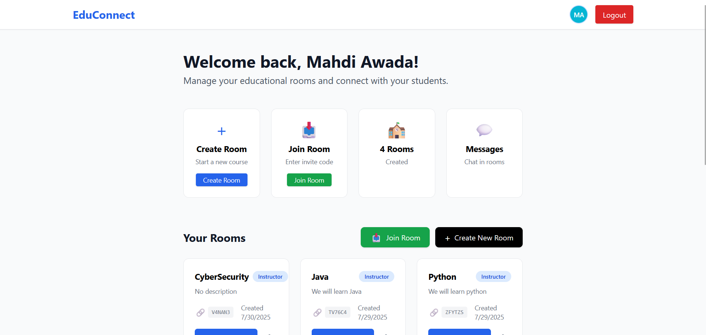

# EduConnect
EduConnect started as a learning project to explore WebSockets but grew into a fully functional web app with real-time features.

## Project Topic
- 👨‍🏫 Instructors can create rooms and invite members via email
- 💬 Custom chats inside rooms, each with its own messages
- 🎥 Built-in video meetings using Jitsi API
- 📊 Instructor-only dashboard

## Tech Stack Used

Backend: Node.js, TypeScript, Express.js, Socket.IO, NodeMailer

Frontend: Tailwind CSS, Native JavaScript

Security: JWT Authentication, RBAC Authorization

Architecture: Three-layer backend (Repositories / Services / Controllers)

Video Meeting Functionality: I used simple Jitsi API

## Project Interface

## Conclusion

What I learned through this project:

Implementing real-time communication with WebSockets.

Structuring backend logic using the Repositories–Services–Controllers pattern.

Managing role-based access control (RBAC).

Sending automated emails via NodeMailer.

Securing backend services with JWT and TypeScript.

This was mainly a learning project to get hands-on experience with WebSockets, but I ended up building something functional and feature-rich along the way!
